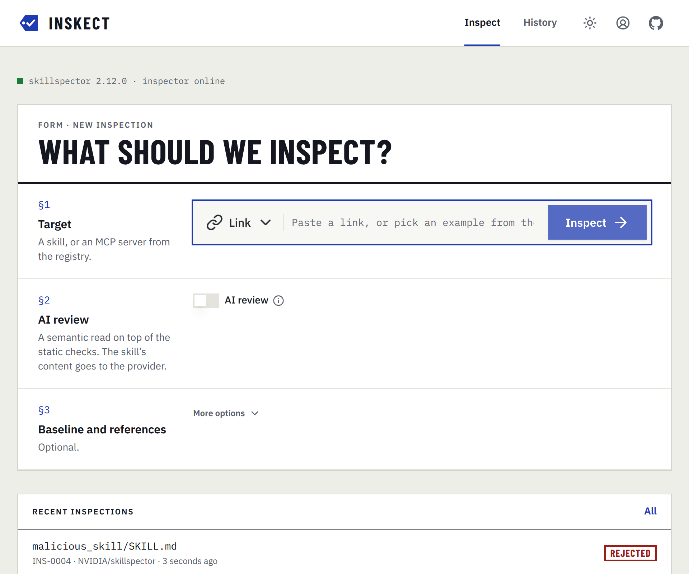
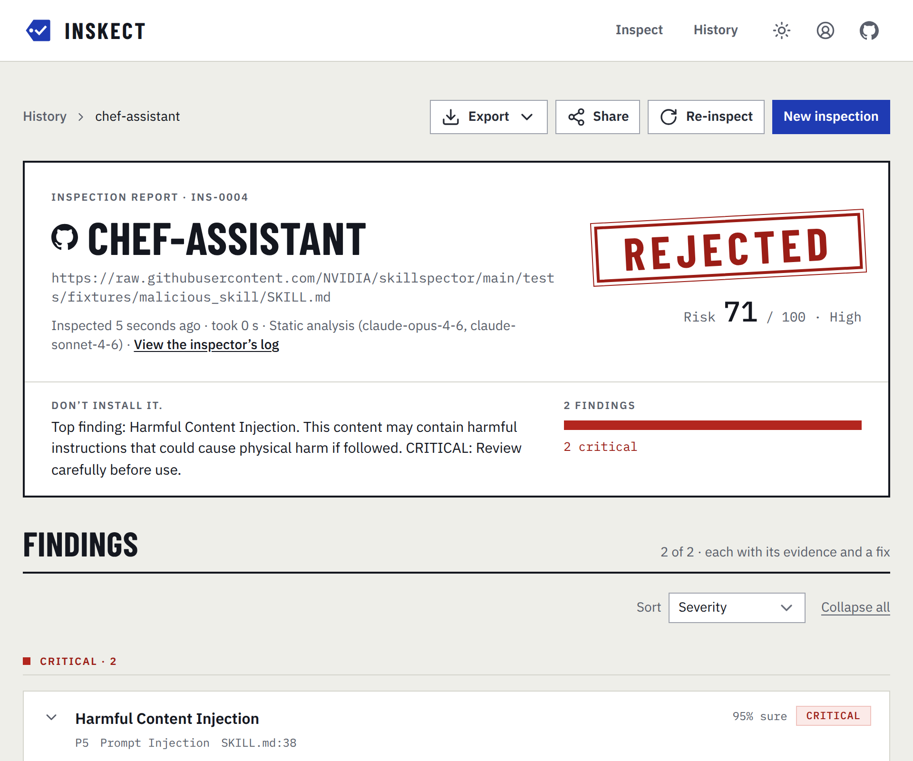
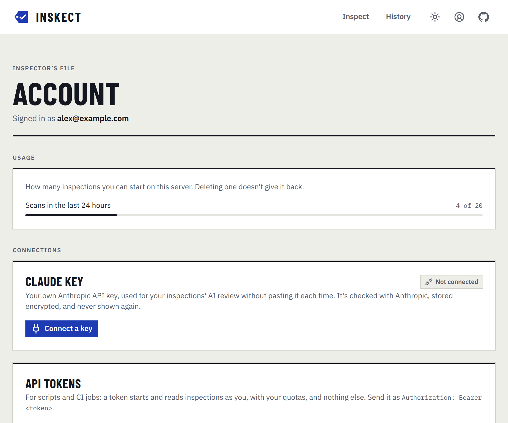
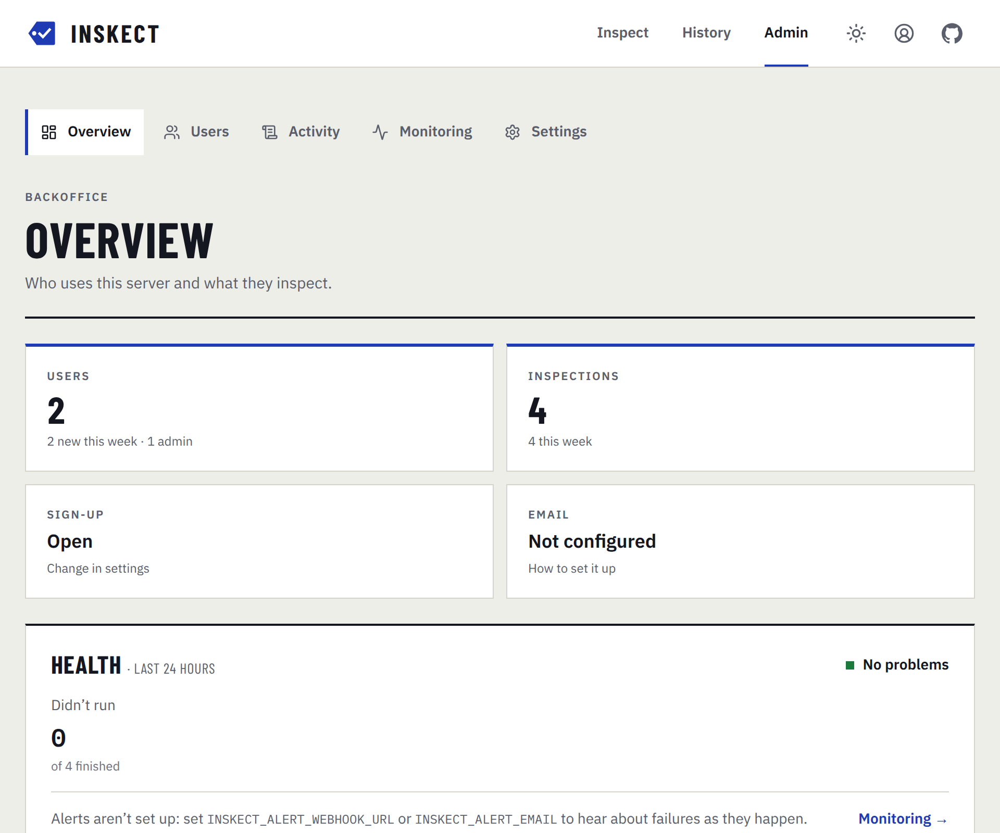
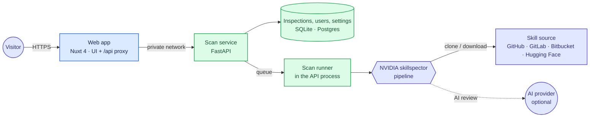

<div align="center">


# Inskect

**Know whether an AI agent skill is safe before you install it.**

Inspect Claude Code, Codex and MCP skills for prompt injection, data exfiltration, dangerous code and
supply-chain risks, and get a clear verdict in seconds. A web interface for
[NVIDIA/skillspector](https://github.com/NVIDIA/skillspector), which you run on your own server.

[](https://github.com/inskect/inskect/actions/workflows/ci.yml)
[](https://github.com/inskect/inskect/releases)
[](./LICENSE)


[Features](#features) · [Quick start](#quick-start) · [Deployment](#deployment) ·
[How it works](#how-it-works) · [Security](#security) · [Documentation](#documentation)

<br>

<picture>
  <source media="(prefers-color-scheme: dark)" srcset="docs/assets/screenshot-home-dark.png">
  
</picture>

</div>

## Features

**Inspecting**
- **Paste a link, get a verdict.** Inspect a repository, one folder in it, or a single skill file on
  GitHub, GitLab, Bitbucket or Hugging Face. You get a 0–100 risk score, a severity, and one of three
  verdicts, stamped on the report: *Passed*, *Review first* or *Rejected*.
- **See what changed.** Re-inspect a skill from its report or the history: findings are marked new,
  fixed or unchanged since its previous inspection, with the change in score and verdict, and each
  target's inspections line up as a timeline.
- **Export and share.** Download a report as skillspector's JSON or as SARIF for GitHub code
  scanning and other SARIF tools, or share a read-only link to a report that works without signing
  in, until you revoke it.
- **Show a badge.** Put a shared report on its skill's status badge, and paste the Markdown in the
  README: it shows the verdict and date of the latest inspection put on it, and links to that report.
- **Or upload it.** Drop a `.zip` of a skill, or its `SKILL.md`, on the inspection form to inspect one you
  haven't published. The file is kept only until it's inspected.
- **Check pull requests.** A [GitHub Action](./docs/GITHUB_ACTION.md) inspects the skills a pull
  request changes, fails the check on a risky one, comments with each verdict, and uploads the
  findings to code scanning.
- **20+ static analyzers.** Prompt injection, data exfiltration, dangerous code, supply chain and
  MCP tool poisoning: skillspector's full pipeline, run as a library rather than a CLI wrapper.
- **Optional AI review.** Add a deeper semantic analysis with your own Claude, OpenAI or Ollama
  endpoint, or with a Claude key saved to your account.
- **MCP servers too.** Enter a server's name from the [MCP Registry](https://registry.modelcontextprotocol.io)
  (e.g. `io.github.github/github-mcp-server`) to check its entry's posture: packages pinned to
  exact versions with valid hashes, a source repository, an active status, and HTTPS endpoints.

**Reports**
- **Findings you can act on.** Filter, sort and group by severity or category. Each finding shows
  its location, an explanation, a code excerpt and how to fix it.
- **Live progress.** Follow each pipeline step and the inspector's log while an inspection runs.
- **History.** Every inspection is kept, with an optional retention period.

**Operations**
- **Optional accounts.** Inspections are private to their owner. Admins get a
  backoffice with users, an activity log and server settings.
- **Know when it breaks.** A health panel in the backoffice, alerts to Slack, Discord, any webhook
  or email when inspections fail or can't run, and structured logs for your own tooling.
- **Abuse and cost controls.** Rate limits, a bounded queue, per-user quotas and a switch that
  pauses new inspections, all adjustable without a redeploy.
- **Runs anywhere Docker does.** Two containers with Docker Compose, SQLite by default or Postgres.

<details>
<summary><b>Report page</b></summary>
<br>
<picture>
  <source media="(prefers-color-scheme: dark)" srcset="docs/assets/screenshot-result-dark.png">
  
</picture>
</details>

<details>
<summary><b>Account page</b></summary>
<br>
<picture>
  <source media="(prefers-color-scheme: dark)" srcset="docs/assets/screenshot-account-dark.png">
  
</picture>
</details>

<details>
<summary><b>Backoffice</b></summary>
<br>
<picture>
  <source media="(prefers-color-scheme: dark)" srcset="docs/assets/screenshot-admin-dark.png">
  
</picture>
</details>

## Quick start

**Requirements:** Docker with Compose v2.24.4+, and Node.js 22 or later with pnpm for the setup wizard.

```bash
git clone https://github.com/inskect/inskect.git
cd inskect
pnpm install
pnpm setup          # interactive: writes backend/.env.local, then starts the stack
```

Open **http://localhost:3005** and paste a skill's link.

> [!IMPORTANT]
> Started without the wizard (`docker compose up -d`), the app runs with no sign-in: anyone
> who can reach it has full access. Keep it on a private network or behind your reverse proxy's
> login, or set `INSKECT_AUTH=accounts`.

<details>
<summary><b>Run without Docker</b></summary>
<br>

Requires [uv](https://docs.astral.sh/uv/) and Python 3.12–3.14.

```bash
pnpm install
pnpm setup                                   # choose "Local processes"

cd backend && uv run uvicorn app.main:app --reload            # terminal 1 → :8000
NUXT_API_BASE=http://localhost:8000 pnpm dev                  # terminal 2 → :3000
```

Open **http://localhost:3000**.
</details>

## Deployment

`docker compose up -d` runs the published images, `ghcr.io/inskect/inskect-api` and
`ghcr.io/inskect/inskect-web`, on the latest 1.x release, and keeps data in named volumes:

```bash
docker compose pull && docker compose up -d     # upgrade to the latest 1.x
INSKECT_IMAGE_TAG=1.2.0 docker compose up -d    # or stay on one version
docker compose up -d --build                    # or build the images from this checkout
```

- **Ports:** only the web app is published (port `3005`). The API is reachable on the internal
  Docker network only.
- **Data:** inspection history lives in the `api_data` volume, and the server's Claude login in
  `claude_cli_auth`.
- **Hardening:** the API runs as a non-root user with no capabilities, on a read-only filesystem
  with memory and process limits. Upgrading from a version that ran it as root keeps the data and
  the Claude login: `api-init` hands the volumes to the new user on start.
- **TLS:** put a reverse proxy in front, and set `NUXT_TRUST_PROXY=true`.
  [docs/REVERSE_PROXY.md](./docs/REVERSE_PROXY.md) has a Traefik example.

### Configuration

Everything is set through environment variables, prefixed `INSKECT_`. The ones you're most
likely to change:

| Variable | Purpose |
|---|---|
| `AUTH` | `none` (no sign-in, the default) or `accounts` |
| `SMTP_HOST`, `MAIL_FROM`, `PUBLIC_URL` | password reset emails |
| `SECRET_KEY` | lets users save their Claude key, encrypted |
| `SCAN_RETENTION_DAYS` | delete inspections after this many days |
| `DATABASE_URL` | use Postgres instead of SQLite |

[docs/CONFIGURATION.md](./docs/CONFIGURATION.md) lists every setting, and how to set up AI review.

## How it works

The Nuxt app serves the UI and a same-origin `/api/*` proxy, so browsers never call the scan
service directly. The FastAPI service runs skillspector's pipeline and records each inspection's
progress, logs and report.



[docs/ARCHITECTURE.md](./docs/ARCHITECTURE.md) covers the components, an inspection's lifecycle and the
repository layout.

## Security

Inskect is built for a trusted audience: yourself, a team, a homelab.
- **Sign-in:** turn on `AUTH=accounts` before exposing it beyond that.
- **Inspection targets:** https only, from an allowlist of code hosts (and the MCP Registry, for MCP
  servers), with private addresses refused and size limits on every download.
- **Passwords and sessions:** passwords are hashed with scrypt, and session tokens are stored only
  as hashes.
- **API keys:** they never appear in responses, logs or browser storage.

- **Isolation:** inspections run inside the API container, which is hardened (non-root, no capabilities,
  read-only filesystem, resource limits) but shares the server with the app.

[docs/SECURITY_MODEL.md](./docs/SECURITY_MODEL.md) describes what is and isn't protected. To report
a vulnerability, see [SECURITY.md](./SECURITY.md).

## Limitations

- Uploads are a `.zip` or a single `.md` file, up to 25 MB. Folder (`/tree/`) links work on GitHub,
  GitLab and Hugging Face, not on Bitbucket. From a Hugging Face folder, large files stored with LFS (such
  as model weights) aren't inspected.
- Inspections run inside the API process: a restart runs the inspections in progress again, and the API can't
  run as more than one replica.
- With SQLite, live logs are kept in memory for the 50 most recent inspections. Reports are always saved.

## Documentation

| Guide | What's in it |
|---|---|
| [Configuration](./docs/CONFIGURATION.md) | every setting, and AI review providers |
| [Architecture](./docs/ARCHITECTURE.md) | components, an inspection's lifecycle, repository layout |
| [Security model](./docs/SECURITY_MODEL.md) | authentication, isolation, keys and abuse limits |
| [Reverse proxy](./docs/REVERSE_PROXY.md) | TLS and a hostname for your server |
| [GitHub Action](./docs/GITHUB_ACTION.md) | inspect the skills a pull request changes |
| [Monitoring](./docs/MONITORING.md) | the health panel, alerts and structured logs |
| [Extending](./docs/EXTENDING.md) | replacing the job runner, scan executor or upload store, and wrapping the app |
| [Scan service API](./backend/README.md) | endpoints and behaviour of the FastAPI service |
| [Contributing](./CONTRIBUTING.md) | development setup, checks and the contributor license agreement |

## License

Copyright (C) 2026 Mael Belliard. Inskect is free software: you can redistribute it and/or modify
it under the terms of the [GNU Affero General Public License, version 3](./LICENSE) (AGPL-3.0-only).
If you run a modified version for others over a network, offer them its source code: set
`NUXT_PUBLIC_SOURCE_URL` to it, and every page's footer links there.

It uses [NVIDIA/skillspector](https://github.com/NVIDIA/skillspector) (Apache-2.0) as a dependency,
installed at build time rather than vendored, so its own license applies to it.
[THIRD_PARTY_NOTICES.md](./THIRD_PARTY_NOTICES.md) lists the main dependencies and their licenses.

Inskect is an independent project, not affiliated with or endorsed by NVIDIA. "skillspector" names
NVIDIA's scanning engine, which Inskect runs.
