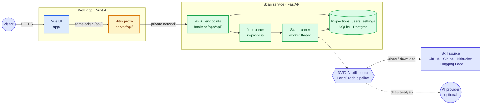

# Architecture

Inskect has two parts. The **web app** (Nuxt 4) serves the UI and a same-origin `/api/*`
proxy (Nitro), so browsers never talk to the scan service directly. The **scan service**
(FastAPI) imports [skillspector](https://github.com/NVIDIA/skillspector) as a library, runs its
LangGraph pipeline, and records each inspection's progress, logs and report.

| Piece | How it works |
|---|---|
| Storage | SQLite file by default, or Postgres (`DATABASE_URL`) |
| Job runner | asyncio tasks in the API process; the queue lives in the database |
| Scan runner | inside the API process, in a worker thread |
| Logs and progress | in memory with SQLite, in the database with Postgres |
| Rate limits | in memory with SQLite, in the database with Postgres |
| Retention sweep | hourly background task in the API |
| Sign-in | off or on (`AUTH`) |

## Overview



## An inspection's lifecycle

1. The form posts to `/api/scan`.
2. The API checks the request:
   - it validates the target and rewrites a code host's file view (`/blob/`) to the raw file
   - it applies the pause switch, the rate limits, the queue cap and the user's quotas
   - it records a `pending` inspection and hands it to the job runner
3. The runner starts the inspection: an asyncio task runs it in a worker thread. After a restart, inspections
   still pending or running are run again.
4. As the pipeline runs, each finished step and log line is recorded against the inspection (in the
   database store, in batches about once a second). The report page polls status and new log lines,
   every two seconds at first and slower as an inspection runs long, until the report is stored.

## Repository layout

```text
app/                      Vue UI: pages, components, composables, client utils
server/api/               Nitro proxy routes, one per backend endpoint
server/routes/            public routes outside /api: the status badge (/badge)
server/utils/             proxy helpers: backend calls, sessions, client IP
shared/                   types and URL helpers shared by the UI and the proxy
backend/app/
  main.py                 FastAPI app and startup checks
  api/routes/             scan, account, auth, users, backoffice, settings, admin
  auth/                   accounts, sessions, password hashing and reset links
  core/                   settings (config.py), and loading the replaceable pieces (extensions.py)
  storage/                SQLite and Postgres stores with versioned migrations
  jobs/                   the in-process job runner
  scanner.py              the skillspector pipeline runner
  scan_runner.py          runs one inspection on its own, reporting events on stdout
  monitoring.py           structured log events, the health panel and alerts
  quotas.py               per-user inspection quotas and the pause switch
  rate_limit.py           sliding-window rate limits
  retention.py            deletes inspections past the retention period
  claude_key.py           users' saved Claude keys (encrypted by secrets_box.py)
  targets.py              rewrites code host file links to the raw file
backend/tests/            pytest suite
test/                     Vitest suite
docs/                     guides and README assets
scripts/setup.mjs         the `pnpm setup` wizard
action.yml, action/       the GitHub Action that inspects a pull request's skills
```

The scan service's endpoints and behaviour are documented in
[backend/README.md](../backend/README.md).
